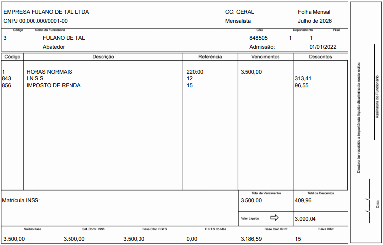

# ContraCheck 


[](https://snyk.io/test/github/RafaelBalreira/ContraCheck?targetFile=backend/requirements.txt)
[](https://snyk.io/test/github/RafaelBalreira/ContraCheck?targetFile=frontend/package.json)

Sistema web para leitura automatizada de contracheques em PDF, extração de dados de cada folha e geração de relatórios consolidados (CSV, Excel e PDF).

## Visão Geral

O ContraCheck recebe um ou mais arquivos PDF de contracheques (holerites), extrai automaticamente o **nome do funcionário** e o **total de vencimentos** de cada página, e permite exportar os dados consolidados em três formatos.

### Fluxo de Uso

1. O usuário arrasta ou seleciona um ou mais arquivos PDF de contracheque
2. O sistema processa cada página do PDF, extraindo nome e total de vencimentos
3. Os resultados são exibidos em uma tabela com busca, ordenação e paginação
4. O usuário pode exportar os dados como **CSV**, **Excel** ou **PDF**

## Exemplo de Entrada (Holerite)



Cada página do PDF contém:
- Cabeçalho com dados da empresa (razão social, CNPJ, centro de custo, tipo de folha)
- Dados do funcionário: código, nome, CBO, departamento, filial, data de admissão, cargo
- Tabela de vencimentos e descontos (código, descrição, referência, valores)
- Totais de vencimentos, descontos e valor líquido
- Rodapé com bases de cálculo (salário base, FGTS, IRRF, etc.)

## Stack Tecnológica

### Backend

| Componente | Tecnologia |
|------------|------------|
| Framework | FastAPI |
| Servidor | Uvicorn |
| Extração de PDF | pdfplumber |
| Manipulação de dados | pandas |
| Relatório Excel | openpyxl |
| Relatório PDF | fpdf2 |
| Testes | pytest + httpx |

**Python 3.13+**

### Frontend

| Componente | Tecnologia |
|------------|------------|
| Framework | Angular 19 |
| UI Components | Angular Material 19 |
| Estado | Angular Signals |
| Estilo | SCSS |
| Type Checking | TypeScript 5.7 |

### Arquitetura

```
┌─────────────────────────────────────┐
│          Browser (SPA)              │
│    Angular 19 + Angular Material    │
└───────────────┬─────────────────────┘
                │ HTTP REST / JSON
┌───────────────▼─────────────────────┐
│         FastAPI Server              │
│         (Python 3.13)               │
└──┬────────────┬────────────┬────────┘
   │            │            │
PdfExtractor  Extraction   ReportService
(pdfplumber)  Strategy      (pandas/fpdf2)
              (lógica pura)
```

**Clean Architecture** com três camadas:
- **Domain** — Modelos de dados (`PaySlip`, `IgnoredRecord`, `ProcessResult`) e exceções customizadas
- **Application** — Lógica de negócio: orçestrção do processamento (`PdfService`), estratégia de extração baseada em coordenadas (`ExtractionStrategy`), geração de relatórios (`ReportService`)
- **Infrastructure** — Extração de texto do PDF via pdfplumber (`PdfExtractor`)

## Estrutura do Projeto

```
ContraCheck/
├── LICENSE                          MIT License
├── README.md
├── backend/
│   ├── main.py                      Ponto de entrada FastAPI
│   ├── requirements.txt             Dependências Python
│   ├── .coveragerc                  Configuração de cobertura
│   ├── domain/
│   │   ├── models.py                PaySlip, IgnoredRecord, ProcessResult
│   │   └── exceptions.py            PDFError, InvalidPDFError, etc.
│   ├── application/
│   │   ├── extraction_strategy.py   Extração por coordenadas (x, y)
│   │   ├── pdf_service.py           Orçestrção do processamento
│   │   └── report_service.py        CSV, XLSX e PDF
│   ├── infrastructure/
│   │   └── pdf_extractor.py         Extração de texto via pdfplumber
│   └── tests/
│       ├── conftest.py              Fixtures compartilhadas
│       ├── test_api.py              Testes de integração da API
│       ├── test_extraction.py       Testes unitários da estratégia
│       ├── test_pdf_extractor.py    Testes de extração de PDF
│       ├── test_pdf_service.py      Testes do serviço completo
│       └── test_report_service.py   Testes de geração de relatórios
├── frontend/
│   ├── package.json                 Dependências Angular
│   ├── angular.json                 Configuração do Angular CLI
│   ├── tsconfig.json
│   └── src/
│       ├── main.ts
│       ├── styles.scss
│       └── app/
│           ├── app.component.ts     Componente raiz (máquina de estados)
│           ├── models/
│           │   └── report.models.ts Interfaces TypeScript
│           ├── services/
│           │   ├── pdf-upload.service.ts   Upload de PDFs
│           │   └── export.service.ts       Download de exportações
│           └── components/
│               ├── upload-area/           Arrastar e soltar PDFs
│               ├── progress-indicator/    Spinner e resumo
│               ├── report-table/          Tabela de resultados
│               ├── ignored-records-panel/ Registros ignorados
│               └── error-display/         Mensagens de erro
└── .github/
    ├── workflows/
    │   ├── ci.yml                   CI: testes + badge de cobertura
    │   └── build.yml                Build de executável via PyInstaller
    └── badges/
        └── backend-coverage.svg     Badge de cobertura (auto-gerado)
```

## API REST

Base URL: `http://localhost:8000`

### Endpoints

| Método | Rota | Descrição |
|--------|------|-----------|
| `POST` | `/api/upload` | Envia um ou mais PDFs e retorna os dados extraídos |
| `GET` | `/api/export/csv?token={token}` | Baixa relatório em CSV |
| `GET` | `/api/export/xlsx?token={token}` | Baixa relatório em Excel |
| `GET` | `/api/export/pdf?token={token}` | Baixa relatório em PDF formatado |

### POST /api/upload

**Request:** `multipart/form-data` com campo `files` (um ou mais arquivos PDF)

**Response JSON:**

```json
{
  "token": "a1b2c3...",
  "records": [
    {
      "employeeName": "FULANO DE TAL",
      "totalVencimentos": "3.500,00",
      "sourceFile": "contracheque.pdf"
    }
  ],
  "ignoredRecords": [
    {
      "page": 18,
      "reason": "Valores redactados com asteriscos",
      "sourceFile": "contracheque.pdf"
    }
  ],
  "totalPages": 102,
  "totalRecords": 100,
  "ignoredRecordsCount": 2,
  "warnings": []
}
```

### Erros

| Código | Situação |
|--------|----------|
| `400` | Arquivo inválido, vazio ou muito grande (>100MB) |
| `404` | Token de sessão inválido ou expirado |
| `422` | PDF protegido por senha |
| `500` | Erro interno na extração |

### Sessões

O upload retorna um **token** que mantém os dados em memória. Os endpoints de exportação usam esse token para acessar a sessão. Não há armazenamento persistente — ao reiniciar o servidor, as sessões são perdidas.

## Instalação e Execução

### Pré-requisitos

- Python 3.13+
- Node.js 18+ e npm

### Backend

```bash
cd backend
python -m venv .venv
.venv\Scripts\activate        # Windows
# source .venv/bin/activate   # Linux/Mac
pip install -r requirements.txt
uvicorn backend.main:app --host 0.0.0.0 --port 8000 --reload
```

### Frontend

```bash
cd frontend
npm install
npm start
```

O frontend estará disponível em `http://localhost:4200` e o backend em `http://localhost:8000`.

### Testes

```bash
# Backend (todos os testes)
cd backend
python -m pytest tests/ -v

# Backend (apenas testes independentes do PDF de amostra)
python -m pytest tests/test_extraction.py -v

# Backend com cobertura
python -m pytest tests/ -v --cov=. --cov-report=term-missing

# Frontend (watch mode)
cd frontend
ng test

# Frontend com cobertura (CI)
ng test --no-watch --browsers=ChromeHeadlessNoSandbox --code-coverage
```

> **Nota:** Alguns testes de integração requerem um PDF de amostra que não está incluído no repositório por questões de privacidade.

## Regras de Extração

O sistema processa apenas a **metade superior** de cada página do PDF, onde ficam os dados do funcionário. A metade inferior contém apenas informações de formatação e é ignorada.

### O que é extraído

| Campo | Método de localização |
|-------|-----------------------|
| Nome do funcionário | Busca pelo rótulo "Nome do Funcionário" e captura o bloco de texto adjacente à direita |
| Total de vencimentos | Busca pelo rótulo "Total de Vencimentos" e captura o valor numérico à direita |

### Regras de descarte

- Páginas com valores redactados (apenas asteriscos `*`) são marcadas como ignoradas
- Páginas onde o rótulo "Nome do Funcionário" não é encontrada são ignoradas
- Texto vertical/rotacionado (ex.: "Assinatura", "Data") é filtrado automaticamente

## Funcionalidades do Frontend

- **Upload por arrastar e soltar** — aceita múltiplos arquivos PDF
- **Tabela de resultados** — busca por nome, ordenação por coluna, paginação (5/10/25/50 itens)
- **Exportação** — botões para CSV, Excel e PDF
- **Painel de registros ignorados** — exibe páginas descartadas com motivo
- **Indicador de progresso** — spinner durante processamento, resumo ao final
- **Tratamento de erros** — mensagens claras para PDFs inválidos, protegidos ou vazios

## Aviso de Uso de IA

Este projeto foi desenvolvido com assistência de inteligência artificial. As decisões de arquitetura, implementação, testes e documentação foram realizadas com o auxiliar de um modelo de linguagem (LLM), revisadas e validadas pelo autor do projeto.

## Licença

[MIT](LICENSE) — Copyright (c) 2026 Rafael Balreira dos Santos

### Compatibilidade de Licenças das Dependências

Todas as dependências são compatíveis com a licença MIT:

| Biblioteca | Licença | Uso |
|------------|---------|-----|
| FastAPI | MIT | Framework web |
| Uvicorn | BSD-3-Clause | Servidor ASGI |
| pdfplumber | MIT | Extração de texto de PDF |
| pandas | BSD-3-Clause | Manipulação de dados |
| openpyxl | MIT | Geração de planilhas Excel |
| fpdf2 | LGPL-3.0+ | Geração de relatórios PDF |
| python-multipart | Apache-2.0 | Upload de arquivos |
| pytest | MIT | Testes |
| httpx | BSD-3-Clause | Cliente HTTP para testes |
| PyInstaller | GPL-2.0+ | Build de executável (dev only) |

> **Nota sobre PyInstaller:** A licença GPL do PyInstaller não afeta o projeto pois é utilizada apenas para build do executável. O código gerado pelo PyInstaller não é coberto pela GPL — apenas o próprio PyInstaller é.
